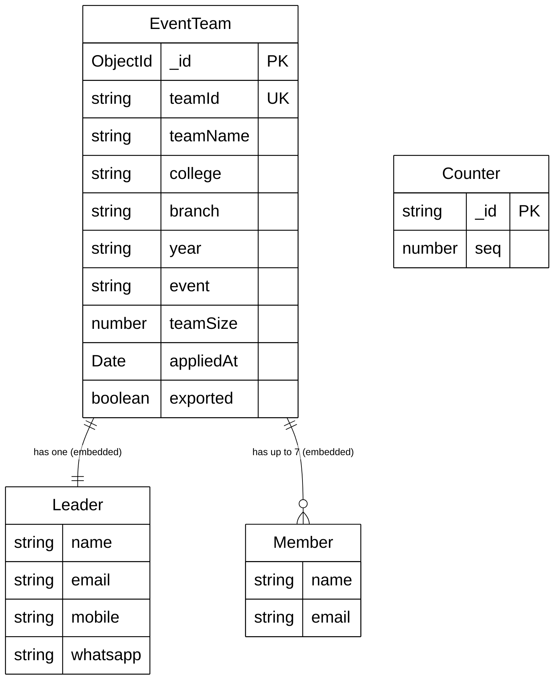

# CROSSROADS 2026 Codebase Analysis & Entity-Relationship Mapping

## Entities and Attributes

### 1. **Counter**
Registers sequential IDs for tracking.
- `_id` *(String)* - Primary Key (e.g., "event_2026")
- `seq` *(Number)* - Current sequence value

### 2. **EventTeam**
The core entity holding details about a registered team.
- `_id` *(ObjectId)* - Primary Key
- `teamId` *(String)* - Unique team identifier
- `teamName` *(String)* - Team name
- `college` *(String)* - College of registration
- `branch` *(String)* - Branch of study
- `year` *(String)* - Year of study
- `event` *(String)* - Target event
- `teamSize` *(Number)* - Number of members in the team (1-8)
- `appliedAt` *(Date)* - Timestamp of registration
- `exported` *(Boolean)* - Export status flag for analytics/admin use

### 3. **Leader** (Embedded inside EventTeam)
Details of the team leader.
- `name` *(String)*
- `email` *(String)*
- `mobile` *(String)*
- `whatsapp` *(String)*

### 4. **Member** (Embedded Array inside EventTeam)
Details of additional team members.
- `name` *(String)*
- `email` *(String)*

---

## Entity-Relationship Diagram

### Mermaid Representation

### SVG Image
(See `diagram_er.svg` in this directory for the generated SVG)
